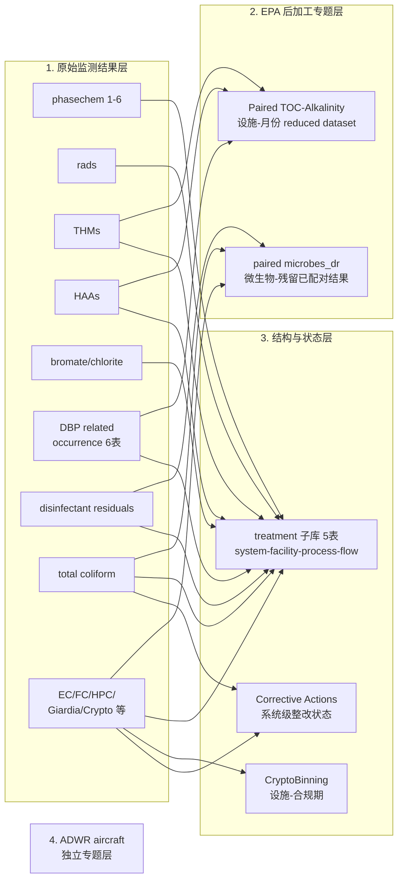
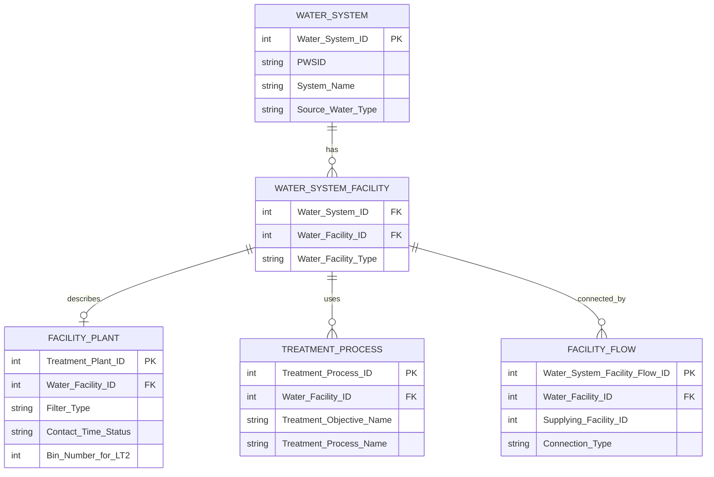
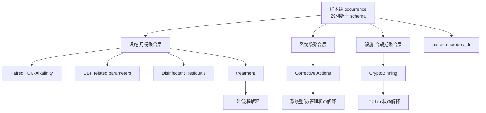

# SYR4 数据集全景说明与对齐指南

基于以下四类信息整理：

- EPA 官方页面：<https://www.epa.gov/dwsixyearreview/six-year-review-4-compliance-monitoring-data-2012-2019>
- EPA User Guide：<https://www.epa.gov/system/files/documents/2024-11/user-guide-to-downloading-and-using-syr4-data_0.pdf>
- 你本地的 `D:\SYR4_Data` 全部数据文件
- 你已有说明文档 `C:\Users\yueya\Desktop\SYR4_数据库说明书_包意义对齐版.md`

本说明的目标不是重复官网目录，而是回答 4 个真正会影响使用的问题：

1. SYR4 里到底有哪些“逻辑层”而不只是哪些 zip 包。
2. 哪些文件其实是同一种表结构，哪些是完全不同的子数据库。
3. 不同研究问题应该从哪个包起步，按什么粒度对齐。
4. 哪些包不能直接横向拼接，必须先聚合或降粒度。

## 1. 一眼看懂：SYR4 不是一个表，而是 5 层数据体系

我对 `D:\SYR4_Data` 做了逐表扫描。当前本地目录包含：

- `19` 个数据包目录
- `133` 个 `.txt/.TXT` 数据表
- `11` 种唯一表结构
- 全部文本表合计 `88,809,663` 行
- 其中 `123` 个文件共用同一套 `29` 列 occurrence schema，合计 `87,545,560` 行

最重要的结论是：

- EPA 官网是按“监管专题/下载包”分组，不是按关系数据库实体分组。
- 真正的数据库逻辑可以分成 5 层：原始监测结果层、EPA 后加工专题层、treatment 结构层、规则状态/管理层、独立专题层。



这张图对应的核心理解是：

- `occurrence` 层回答“测到了什么”。
- `paired` 层回答“EPA 为特定监管问题已经替你整理好了什么”。
- `treatment` 层回答“这些结果挂在哪个 system / facility / process 上”。
- `cryptobinning / corrective actions` 回答“系统处于什么规则状态或管理状态”。
- `ADWR` 是飞机饮用水规则专题，不建议与地面公共供水系统主线直接混合建模。

如果当前查看器不渲染 Mermaid，可以直接看这个纯文本版本：

```text
SYR4
├─ 原始监测结果层
│  ├─ 化学类：phasechem 1-6
│  ├─ 放射类：rads
│  ├─ DBP 结果：THMs / HAAs / bromate_chlorite
│  ├─ DBP 前体与条件：DBP_Related Parameters（6 个 occurrence 文件）
│  ├─ 消毒残留：Disinfectant Residuals
│  ├─ 微生物：tc / ec_fc_hpc_giardia
│
├─ EPA 后加工专题层
│  ├─ Paired TOC-Alkalinity：设施-月份 reduced dataset
│  └─ paired-microbes_dr：微生物-残留已配对专题集
│
├─ 结构层
│  └─ treatment：system -> facility -> plant/process/flow
│
├─ 状态层
│  ├─ cryptobinning：设施-合规期状态
│  └─ corrective_actions：系统级整改状态
│
└─ 独立专题层
   └─ adwr-compliance-data：飞机饮用水规则专题
```

## 2. 官网下载包和本地数据包清单

### 2.1 原始监测结果层

这些包大多共用同一套 `29` 列 occurrence schema，粒度本质上都是“单次样本结果”。

| 数据包 | 文件数 | 本地行数 | 逻辑角色 | 推荐对齐粒度 |
|---|---:|---:|---|---|
| `_syr4_phasechem_1-111-trichloroethane-to-atrazine` | 15 | 4,748,712 | 常规化学污染物 occurrence | 样本级或设施-月份 |
| `_syr4_phasechem_2-barium-to-cyanide` | 14 | 5,398,722 | 常规化学污染物 occurrence | 样本级或设施-月份 |
| `_syr4_phasechem_3-dalapon-to-hexachlorocyclopentadiene` | 16 | 3,752,629 | 常规化学污染物 occurrence | 样本级或设施-月份 |
| `_syr4_phasechem_4-hybrid-nitrate-to-nitrate` | 5 | 5,015,453 | 常规化学污染物 occurrence | 样本级或设施-月份 |
| `_syr4_phasechem_5-nitrate-nitrite-to-total-polychlorinated-biphenyls-pcb` | 14 | 4,911,070 | 常规化学污染物 occurrence | 样本级或设施-月份 |
| `_syr4_phasechem_6-toxaphene-to-xylenes-total` | 5 | 2,108,366 | 常规化学污染物 occurrence | 样本级或设施-月份 |
| `_syr4_rads` | 4 | 297,190 | 放射性污染物 occurrence | 样本级或设施-月份 |
| `SYR4_THMs` | 5 | 5,005,878 | DBP 结果层，含 TTHM 与 4 个组分 | 设施-月份优先 |
| `SYR4_HAAs` | 6 | 4,609,013 | DBP 结果层，含 HAA5 与组分 | 设施-月份优先 |
| `syr4_bromate_chlorite` | 2 | 111,293 | 特定工艺相关 DBP 结果层 | 设施-月份优先 |
| `SYR4_DBP_Related Parameters` 中的 6 个 occurrence 文件 | 6 | 1,522,410 | DBP 前体/形成条件 | 设施-月份优先 |
| `SYR4_Disinfectant Residuals` | 6 | 8,497,933 | 消毒残留原始结果 | 微生物主线可样本级；DBP 主线建议设施-月份 |
| `syr4_tc` | 8 | 20,746,115 | Total Coliform 全量数据 | 样本级 |
| `syr4_ec_fc_hpc_giardia` | 7 | 7,351,443 | 微生物及相关指标全量数据 | 样本级或合规期 |

### 2.2 EPA 后加工专题层

这些包不是“再来一份 occurrence”，而是 EPA 已经按特定规则问题做过降粒度或配对的结果集。

| 数据包 | 文件数 | 本地行数 | 逻辑角色 | 推荐对齐粒度 |
|---|---:|---:|---|---|
| `SYR4_DBP_Related Parameters\Paired TOC-Alkalinity.txt` | 1 | 92,666 | TOC removal 相关的设施-月份 reduced dataset | `PWSID + Water.Facility.ID + Year + Month` |
| `syr4_paired-microbes_dr` | 10 | 13,469,333 | 微生物-消毒残留已配对专题数据 | 样本级 |

### 2.3 结构与状态层

| 数据包 | 文件数 | 本地行数 | 逻辑角色 | 推荐对齐粒度 |
|---|---:|---:|---|---|
| `syr4_treatment` | 5 | 990,261 | system-facility-plant-process-flow 关系子库 | `PWSID` / `Water Facility ID` |
| `syr4_cryptobinning` | 1 | 27,812 | LT2/Cryptosporidium 合规期 bin 状态 | `PWSID + WATER_FACILITY_ID + 合规期` |
| `syr4_corrective_actions` | 1 | 73,758 | 系统级 corrective action 管理状态 | `PWSID` |

### 2.4 独立专题层

| 数据包 | 文件数 | 本地行数 | 逻辑角色 | 推荐对齐粒度 |
|---|---:|---:|---|---|
| `syr4_adwr-compliance-data` | 2 | 79,606 | Aircraft Drinking Water Rule 专题 | 独立使用，不建议并入主线 |

## 3. 真正重要的不是 19 个包，而是 6 类表结构

### 3.1 统一 occurrence schema：29 列，123 个文件

代表文件：

- `SYR4_THMs\TOTAL TRIHALOMETHANES (TTHM).txt`
- `syr4_tc\TOTAL COLIFORM_2019.txt`
- `_syr4_phasechem_1-111-trichloroethane-to-atrazine\SUMMARY_ANALYTE_ARSENIC.txt`

共同字段核心是：

- `PWSID`
- `WATER_FACILITY_ID`
- `SAMPLING_POINT_ID`
- `SAMPLE_COLLECTION_DATE`
- `ANALYTE_CODE`
- `LABORATORY_ASSIGNED_ID`
- `VALUE`
- `UNIT`
- `DETECT`
- `PRESENCE_INDICATOR_CODE`

这意味着：

- 绝大多数官网数据包，底层其实是同一种“样本结果表”。
- `THMs / HAAs / phasechem / rads / DBP-related occurrence / residuals / microbes / TC` 在数据库层面是并列的，不是上下级。
- 真正的区别来自 `ANALYTE_NAME`、监管语境和后续要接哪一层解释表。

### 3.2 Paired TOC-Alkalinity：18 列，设施-月份 reduced dataset

这个文件的结构与 occurrence 完全不同。它不是单次样本，而是月度聚合结果，关键字段是：

- `PWSID`
- `Water.Facility.ID`
- `Year`
- `Month`

所以它不能和 TTHM/HAA 直接按样本级一对一相连。正确做法是：

1. 先把 DBP occurrence 聚合到 `PWSID + WATER_FACILITY_ID + Year + Month`。
2. 再和 `Paired TOC-Alkalinity.txt` 相连。

### 3.3 paired microbes_dr：逻辑上是 reduced dataset，但外观仍是 29 列 occurrence schema

这是最容易误判的一个点。

- 它长得像 occurrence。
- 但业务上它不是全量微生物库，而是 EPA 已做过“微生物-残留配对”的专题成品。
- 官方 guide 说明 paired microbial vs. disinfectant residual 文件只保留了成功配对的记录。

正确理解方式是：

- `syr4_tc` 与 `syr4_ec_fc_hpc_giardia` 是 full datasets。
- `SYR4_Disinfectant Residuals` 是残留全量结果。
- `syr4_paired-microbes_dr` 是已完成配对的专题子集。

### 3.4 treatment：不是一张表，而是一个小型关系数据库

它包含 5 张表，而且键关系是明确的：



真正的 join 逻辑是：

- 监测结果表通过 `WATER_FACILITY_ID` 挂到 treatment 子库。
- treatment 子库再通过 `Water System ID -> PWSID` 挂回系统层。
- `Treatment_Process_table` 和 `Water_system_facility_plant_table` 都不是监测结果表，而是“解释变量层”。

### 3.5 CryptoBinning：设施-合规期状态表

关键字段是：

- `PWSID`
- `WATER_FACILITY_ID`
- `CP_PRD_BEGIN_DT`
- `CP_PRD_END_DT`
- `BIN_NUMBER`

这张表不适合样本级 join。更合理的做法是：

- 先把 `CRYPTOSPORIDIUM` 或相关 microbial occurrence 聚合到设施-时间段。
- 再按设施 + 合规期去接 `CryptoBinning`。

### 3.6 Corrective Actions：系统级管理状态表

关键字段是：

- `PWSID`
- `DATE_ISSUE_IDENTIFIED`
- `DUE_DATE`
- `ACHIEVED_DATE`

它描述的是整改或管理动作，不是监测值。因此最稳妥的做法是：

- 先把 occurrence 聚合到 `PWSID` 或 `PWSID + 年份`
- 再把整改状态作为系统级背景变量接入

## 4. 一张图看明白“哪些包之间能直接连，哪些不能”



对应的直白规则是：

- 想做微生物-残留关系，优先走样本级，直接用 `paired microbes_dr`。
- 想做 DBP 形成机制，优先走设施-月份级，把 `THMs / HAAs / bromate-chlorite / TOC / pH / alkalinity / residuals` 统一聚合后再连。
- 想做 LT2 / Crypto 分析，先做设施-合规期对齐，再接 `CryptoBinning`。
- 想做系统画像或整改状态分析，先聚合到 `PWSID`，再接 `Corrective Actions`。

## 5. 如何对齐：按研究问题选择 join 粒度

### 5.1 DBP 主线

适用问题：

- TTHM/HAA5 与 TOC、DOC、alkalinity、pH、UV、SUVA 的关系
- 消毒残留与 DBP 形成的关系
- 不同工艺对 DBP 的影响

推荐路径：

1. 主表从 `SYR4_THMs`、`SYR4_HAAs`、`syr4_bromate_chlorite` 选。
2. 把结果先聚合到 `PWSID + WATER_FACILITY_ID + Year + Month`。
3. 接 `SYR4_DBP_Related Parameters` 中的 occurrence 文件。
4. 如需 TOC removal 语境，再接 `Paired TOC-Alkalinity.txt`。
5. 再接 `SYR4_Disinfectant Residuals` 的设施-月份聚合值。
6. 最后接 `syr4_treatment`。

最稳妥的 join key：

- `PWSID + WATER_FACILITY_ID + Year + Month`

不要这么做：

- 不要把 `Paired TOC-Alkalinity` 直接按采样日期去配 TTHM/HAA。
- 不要假设 `TTHM` 与 4 个 THM speciation 一定逐条对应。
- 不要把 `THMs`、`HAAs`、`bromate/chlorite` 混成一个完全同义的“DBP 指标池”。

### 5.2 微生物-残留主线

适用问题：

- TC/EC/FC 与 disinfectant residual 的关系
- TCR/RTCR 或 SWTR 语境下的 residual 配对分析

推荐路径：

1. 若研究目标就是“微生物 vs. 残留”，优先直接使用 `syr4_paired-microbes_dr`。
2. 若需要全量背景，再回到 `syr4_tc`、`syr4_ec_fc_hpc_giardia` 和 `SYR4_Disinfectant Residuals`。
3. 如需工艺背景，再接 `syr4_treatment`。

最稳妥的 join key：

- `PWSID + WATER_FACILITY_ID + SAMPLING_POINT_ID + SAMPLE_COLLECTION_DATE`
- 严格匹配时可再加 `LABORATORY_ASSIGNED_ID`

不要这么做：

- 不要把 `paired microbes_dr` 当成微生物全样本总体。
- 不要把 `TC` 和 `HPC / Giardia / Crypto` 混成同一种监管问题。

### 5.3 LT2 / Crypto 主线

适用问题：

- Cryptosporidium 检测与 bin 状态关系
- source water / treatment barrier 与 LT2 语境关系

推荐路径：

1. 主表用 `CRYPTOSPORIDIUM.txt`，必要时加入 `GIARDIA`、`HPC`。
2. 先聚合到设施-合规期。
3. 接 `syr4_cryptobinning`。
4. 再接 `syr4_treatment` 中 plant/process 信息。

最稳妥的 join key：

- `PWSID + WATER_FACILITY_ID + 合规期`

### 5.4 系统风险画像主线

适用问题：

- 某系统是否更容易出现异常结果
- 系统整改状态与结果分布的关系

推荐路径：

1. 先把 occurrence 结果按系统层聚合。
2. 接 `syr4_corrective_actions`。
3. 再用 `syr4_treatment` 中 system/facility 结构做背景解释。

最稳妥的 join key：

- `PWSID`

## 6. treatment 子库该怎么用

这是最容易被当成“普通宽表”误用的部分。

正确理解应该是：

- `SYR4_Water_system_table.txt` 是系统主表。
- `SYR4_Water_system_facility_table.txt` 是 system 与 facility 的桥表。
- `SYR4_Water_system_facility_plant_table.txt` 是 treatment plant 属性表。
- `SYR4_Treatment_Process_table.txt` 是 facility 对应的 process 明细。
- `SYR4_Water_system_flows_table.txt` 是设施之间的供水/连接流向表。

因此正确 join 顺序通常是：

1. occurrence 表用 `WATER_FACILITY_ID` 接 `Water_system_facility_table`。
2. 再通过 `Water System ID` 接 `Water_system_table`。
3. 如需 plant 属性，用 `WATER_FACILITY_ID` 接 `Water_system_facility_plant_table`。
4. 如需工艺枚举，用 `WATER_FACILITY_ID` 接 `Treatment_Process_table`。
5. 如需供水路径，用 `WATER_FACILITY_ID` 接 `Water_system_flows_table`。

一句话概括：

- 监测结果挂在 `facility`
- facility 隶属于 `system`
- process / plant / flow 是 facility 的解释层

## 7. 你现有说明文档里最重要的判断，哪些被保留，哪些被补强

你已有文档里的核心判断基本是对的，我保留了这些框架：

- `occurrence / EPA 后加工包 / treatment 结构包 / 状态包` 的分层思路
- `paired` 不是 full dataset 的判断
- `DBP` 与 `microbial` 需要按不同粒度 join 的判断
- `treatment` 是关系网，不是结果表 的判断

这次补强的地方主要有 5 个：

- 用本地逐表审计把目录从“包名理解”提升到了“11 类表结构理解”。
- 给出了每个包的本地文件数和本地行数，便于估算工作量。
- 明确区分了“样本级、设施-月份级、设施-合规期级、系统级”四种 join 粒度。
- 单独画出了 `treatment` 子库的表间关系图。
- 把不同研究目标对应的推荐主表、推荐 join key、禁忌 join 方式写成了操作规则。

## 8. 使用时最容易踩的坑

### 8.1 官网一个 zip 包不等于一个数据库实体

官网按专题打包，数据库却按粒度和键关系使用。不要用“同包文件”代替“同逻辑层文件”。

### 8.2 长得像 occurrence 的，不一定是 full dataset

`syr4_paired-microbes_dr` 外观看起来和 occurrence 一样，但业务上它是已配对专题子集。

### 8.3 同样是 DBP，也不应该直接混成一张样本大表

`THMs`、`HAAs`、`bromate/chlorite` 和 `DBP related parameters` 在监管语境与解释方向上不同，适合在设施-月份层对齐，而不是样本层强拼。

### 8.4 residual 文件既服务微生物分析，也服务 DBP 分析，但粒度不同

- 微生物主线：更接近样本级、同日同点配对
- DBP 主线：更适合先聚合到设施-月份

### 8.5 `Corrective Actions` 和 `CryptoBinning` 不是结果表

它们是状态表。状态表不能直接替代 occurrence，也不适合和单条样本记录做机械一对一连接。

## 9. 最短版本结论

如果只记 9 句话，记这些就够了：

1. SYR4 本质上是“监测结果层 + EPA 后加工层 + treatment 关系层 + 状态层”的组合库。
2. 你本地 `133` 个文本表里，有 `123` 个其实共用同一个 `29` 列 occurrence schema。
3. `phasechem + rads + THMs + HAAs + bromate/chlorite + DBP-related occurrence + residuals + microbes + TC` 本质上都属于原始结果层。
4. `Paired TOC-Alkalinity` 不是样本表，而是设施-月份 reduced dataset。
5. `paired microbes_dr` 不是微生物全量库，而是已配对专题子集。
6. `treatment` 不是一张宽表，而是一个 system-facility-process-flow 小型关系库。
7. 做 DBP 分析，最稳妥的对齐粒度是 `PWSID + WATER_FACILITY_ID + Year + Month`。
8. 做微生物-残留分析，最稳妥的是样本级，优先直接用 `paired microbes_dr`。
9. 做整改状态或 LT2 状态分析，先把 occurrence 降到系统级或合规期级，再去接状态表。

## 10. 官方来源中对理解最关键的几点

这里不长引原文，只给对使用最关键的官方信息：

- 官网明确按专题提供下载包，`Downloaded Data` 下分为 Organic/Inorganic Chemicals、Radionuclides、Disinfection Byproducts、Microbials、Treatment Information、Additional Data 等类别。
- user guide 明确把 total coliform 拆成按年份文件，因为数据量太大。
- user guide 明确把 `paired microbial vs. disinfectant residual` 描述成 reduced datasets，只保留已完成微生物-残留配对的记录。
- user guide 明确把 `Paired TOC and Alkalinity` 描述成平均月度浓度的 reduced dataset。
- user guide 对 DBP 文件给出特殊提醒：官网提供了 THMs/HAA 等数据，但它们与 SYR4 正式分析对象并不完全等同，使用时要区分“官网可下载”与“SYR4 正式评估是否采用”。

## 11. 你接下来如果要真正落地分析，最稳的起步方式

如果你研究的是 DBPs，我建议直接按下面顺序开工：

1. 先以 `TTHM`、`HAA5` 为目标变量。
2. 把 DBP、TOC、alkalinity、pH、DOC、SUVA、UV、residuals 全部聚合到 `PWSID + WATER_FACILITY_ID + Year + Month`。
3. 再接 `treatment` 里的 facility / process / plant 信息。

如果你研究的是微生物/消毒残留，我建议：

1. 先直接用 `syr4_paired-microbes_dr`。
2. 只有当你需要“未配对的全体背景”时，再回头补 `syr4_tc`、`syr4_ec_fc_hpc_giardia`、`SYR4_Disinfectant Residuals`。

如果你研究的是系统监管画像，我建议：

1. 先把 occurrence 聚合到 `PWSID`。
2. 再接 `Corrective Actions` 和 `treatment`。
